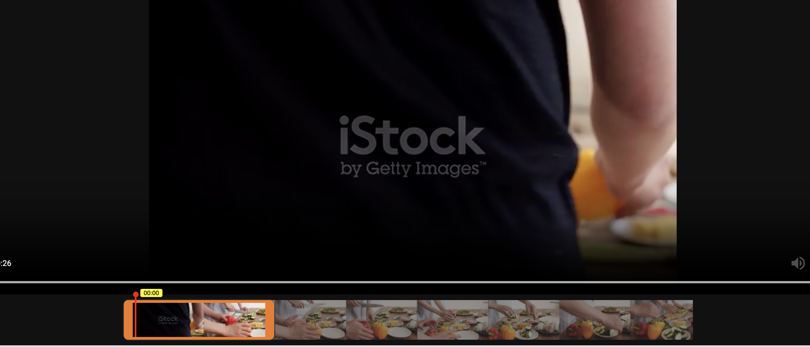
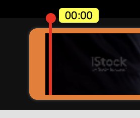
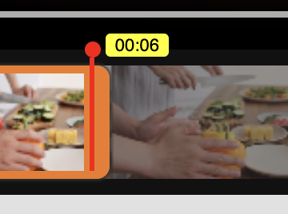
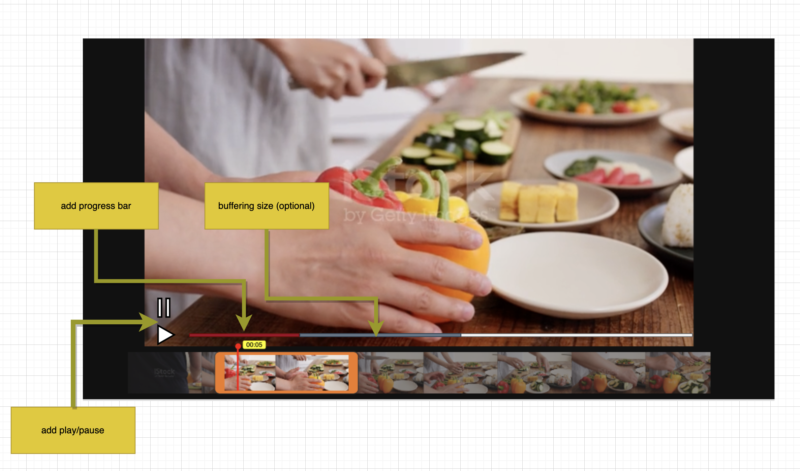
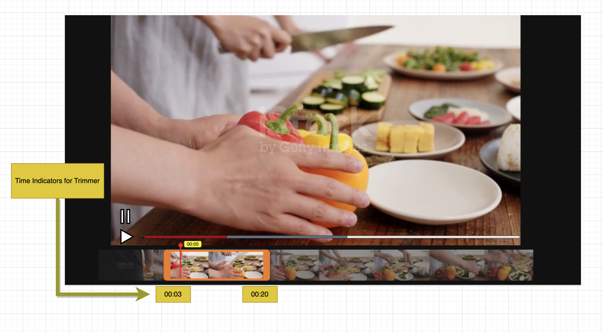
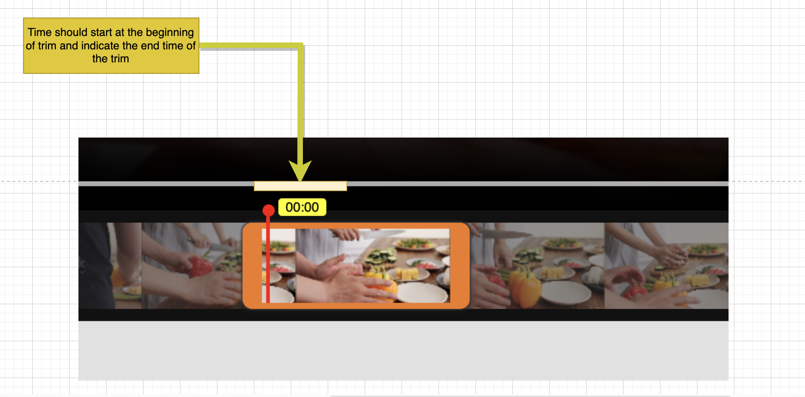

# Senior Full Stack Developer Interview Task

Hello and welcome to Munch!

We're excited to have you as part of our interview process for the Senior Full Stack Developer position. 

This task is designed to assess your technical skills in a practical, hands-on way. 

 - We've prepared a small project for you, 
which should take about 1-2 hours to complete. 

 - Your task involves fixing some bugs and adding new features to a video playback application.

## Project Overview

The application you'll be working on is a simple video playback system. 

It includes a video player, a seek bar with video thumbnails, and a trimmer 

for adjusting the start and end positions of the video. 
There's also a seek indicator showing the current position in the video.

### Your Task

Your task is divided into two main parts: bug fixing and feature addition.

#### Bug Fixes

1. **Video Trimmer Responsiveness:** The video trimmer is currently lagging and not responding smoothly to mouse movements. We'd like you to optimize its performance so that it adjusts smoothly based on the position of the mouse.

2. **Seek Bar Accuracy:** There is an issue with the seek bar pointer's accuracy. It's not aligning correctly with the trimmer's position, especially noticeable at the ends or when clicking on the middle part of the trimmer. Your goal is to ensure that the seek bar accurately reflects the current position of the mouse.

#### Feature Additions

1. **Custom Play/Pause Buttons and Progress Bar:** We'd like you to remove the default video controls and implement custom play and pause buttons. Additionally, a progress bar indicating the current position of the video would be a great addition. If possible, include a visual representation of the buffering size.
(you can use what ever icon/design you feel like it)

2. **Time Indicators for Trimmer:** Implement time indicators at the start and end points of the trimmer. This feature will help users know the exact start and end times of their selected video segment.

3. **Time Indicator for Trimmed Section:** Modify the time indicator on the seek bar so that it displays the time duration between the start and end of the trimmed section, rather than the entire video. This will provide a more accurate and user-friendly experience for manipulating the video segment.

## Guidelines

- **Respect for Time:** We value your time and have designed this task to be completed within 1-2 hours. If you find yourself spending significantly more time, please let us know.
- **Focus on Functionality:** While we appreciate clean and efficient code, the primary focus should be on functionality and solving the presented problems.
- **Questions:** If you have any questions or need clarifications, feel free to reach out. We're here to help!

## Submission

Please submit your code by the agreed deadline. Include any notes or comments you feel are relevant in a separate document or as comments in the code.

## Thank You!

We appreciate your participation in this part of our interview process. We're looking forward to seeing your approach to solving these challenges. Good luck!
